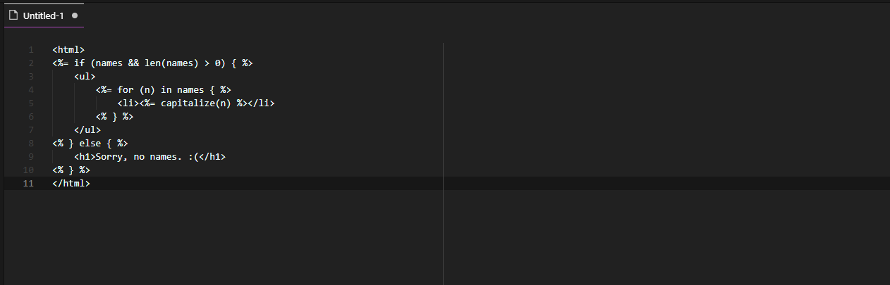

# Plush Syntax

Language support for the Go Plush templating package. See <https://github.com/gobuffalo/plush> or <https://godoc.org/github.com/gobuffalo/plush> to learn more about the Plush templating package.

## Features

Currently there is only support for syntax highlighting within HTML documents.

## Requirements

This extension was tested using VS Code V1.33.

## Known Issues

- Lack of invalid character highlighting
- No hover definitions
- Auto-closing brackets appears to not work

## Contributing

If you'd like to report an issue or help contribute to this project, please visit the repository on Github.

- Repo: <https://github.com/thegoose51/vsce-plush>
- Issues: <https://github.com/thegoose51/vsce-plush/issues>

## Release Notes

### 0.0.1

Initial release

- Syntax highlighting in HTML documents
